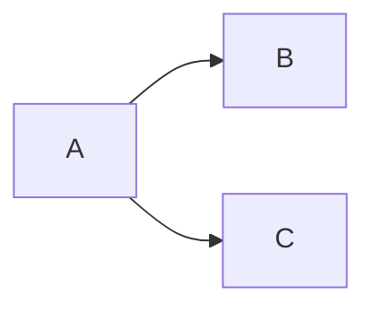

# Confluence with orbit CLI

Manage Confluence pages, publish markdown documentation, and control page layout using the `orbit` CLI. Supports Confluence Cloud and Server/Data Center via REST API with multi-profile support and 1Password secret resolution.

## Prerequisites

1. `orbit` CLI installed — if `which orbit` fails, install with:
   - **macOS/Linux (Homebrew):** `brew install jorgemuza/tap/orbit`
   - **macOS/Linux (script):** `curl -sSfL https://raw.githubusercontent.com/jorgemuza/orbit/main/install.sh | sh`
   - **Windows (Scoop):** `scoop bucket add jorgemuza https://github.com/jorgemuza/scoop-bucket && scoop install orbit`
2. A profile with a `confluence-cloud` or `confluence-server` service configured in `~/.config/orbit/config.yaml`
3. Valid credentials (API token for Cloud, PAT for Server) — can be stored in 1Password with `op://` prefix
4. For Cloud: auth type is `basic` with email as username and API token as password

## Quick Reference

All commands follow the pattern: `orbit -p <profile> confluence <command> [flags]`

For full command details and flags, see `references/commands.md`.
For Confluence storage format (XHTML) details, see `references/storage-format.md`.

## Core Workflows

### Viewing Pages

```bash
# View page details
orbit -p myprofile confluence page 473676972036

# View as JSON (includes body content)
orbit -p myprofile confluence page 473676972036 -o json

# List child pages
orbit -p myprofile confluence children 473676972036

# Show full page hierarchy (ancestors + descendants tree)
orbit -p myprofile confluence hierarchy 473676972036

# Deeper tree (default depth is 2)
orbit -p myprofile confluence hierarchy 473676972036 --depth 5

# JSON tree output
orbit -p myprofile confluence hierarchy 473676972036 -o json
```

### Searching Pages

```bash
# Search by space
orbit -p myprofile confluence search --space FO

# Search by title (fuzzy match)
orbit -p myprofile confluence search --space FO --title "Architecture"

# Search by label
orbit -p myprofile confluence search --space FO --label design

# Full-text search
orbit -p myprofile confluence search --space FO --text "deployment pipeline"

# Raw CQL query
orbit -p myprofile confluence search --cql 'space=FO AND label=design AND type=page'

# Increase result limit (default 25)
orbit -p myprofile confluence search --space ISMS --limit 100
```

### Creating Pages from Markdown

When creating a page from a markdown file, the CLI automatically converts it to Confluence storage format (XHTML). The converter handles headings, lists, tables, code blocks, blockquotes, inline formatting, and images.

```bash
# Create page from markdown file
orbit -p myprofile confluence create --space FO --parent 473677299713 \
  --title "My New Page" --file docs/overview.md

# Create page with inline body (storage format XHTML)
orbit -p myprofile confluence create --space FO --parent 473677299713 \
  --title "Quick Page" --body "<p>Hello world</p>"
```

Pages are automatically created with **wide width** (full-width layout).

### Updating Existing Pages

When `--file` is provided, the `update` command automatically reads the title from frontmatter, syncs labels from `confluence_labels`, prepends page properties from `confluence_properties`, and sets full-width layout — matching the `publish` command behavior. Use `--title` to override the frontmatter title.

```bash
# Update page from markdown (title, labels, properties auto-synced)
orbit -p myprofile confluence update 473676972036 --file docs/overview.md

# Override title explicitly
orbit -p myprofile confluence update 473676972036 \
  --title "Custom Title" --file docs/overview.md

# Update with inline storage format
orbit -p myprofile confluence update 473676972036 --body "<p>New content</p>"
```

### Publishing a Directory of Markdown Files

The `publish` command recursively converts an entire directory of markdown files to Confluence pages, preserving the folder hierarchy:

- `INDEX.md` files become the parent page for their directory
- Other `.md` files become child pages under the directory's parent
- Subdirectories are processed recursively
- Page titles come from frontmatter `title:`, first `# heading`, or filename
- Files with `confluence_ignore: true` are skipped; if previously published, the Confluence page is deleted. When an `INDEX.md` is ignored, the entire subdirectory is skipped.
- **Upsert behavior**: If a page has no `confluence_page_id` in frontmatter, orbit searches by title first. If create fails due to a title conflict (e.g. special characters like `&` in the title), it falls back to listing the parent's children and updating the matching page. After success, `confluence_page_id` is written to frontmatter for future runs.
- All pages are set to **full-width** layout on every create and update.

```bash
# Publish entire docs directory
orbit -p myprofile confluence publish ./docs --space FO --parent 473677299713

# Preview what would be created (no API calls)
orbit -p myprofile confluence publish ./docs --space FO --parent 473677299713 --dry-run
```

### Diagram Rendering

Fenced code blocks with diagram languages are automatically rendered as images via [kroki.io](https://kroki.io) — no Confluence plugins required. Supported languages: `mermaid`, `plantuml`, `graphviz`, `dot`, `d2`, `ditaa`, `erd`, `nomnoml`, `svgbob`, `vega`, `vegalite`, `wavedrom`, `pikchr`, `structurizr`, `excalidraw`, `c4plantuml`.

````markdown

````

This renders as a PNG image (max 600px wide, 800px tall — auto-scaled) with a clickable link to the full-resolution image. Regular code blocks (`python`, `go`, `bash`, etc.) are unaffected. If Kroki rejects a diagram (syntax error), it falls back to a syntax-highlighted code block.

**Mermaid diagrams are auto-sanitized** before rendering to fix common Kroki compatibility issues:
- `<br/>` tags stripped (replaced with `. `)
- Parenthesized suffixes in participant aliases converted: `Worker (queue)` → `Worker - queue`
- Trailing `()` on participant names removed
- Port numbers after colons removed: `API:8000` → `API`
- Reverse arrows flipped: `Client<<--API: msg` → `API-->>Client: msg`

**When writing Mermaid diagrams for Confluence publishing, avoid:**
- HTML tags (`<br/>`) in participant names or notes
- Colons in participant alias text (e.g., `API:8000`)
- Parentheses in participant aliases (e.g., `Worker(queue)`)
- Function-call syntax in aliases (e.g., `dispatch()`)
- Reverse arrows (`<<--`) — Mermaid only supports left-to-right arrows
- ASCII box-drawing characters — use proper Mermaid syntax instead

### Exporting Pages

```bash
# Export page as markdown (default)
orbit -p myprofile confluence export 12345

# Export to a directory
orbit -p myprofile confluence export 12345 --format markdown --output docs/

# Export raw storage format
orbit -p myprofile confluence export 12345 --format storage --output backup/
```

### Setting Page Width

```bash
# Set single page to wide
orbit -p myprofile confluence set-width 473676972036

# Set page and all children to wide
orbit -p myprofile confluence set-width 473676972036 --recursive

# Set to fixed width
orbit -p myprofile confluence set-width 473676972036 --width fixed
```

## Markdown Frontmatter Tracking

When publishing or converting markdown files for Confluence, track the mapping between local files and Confluence pages using YAML frontmatter. After creating or updating a page, update the source markdown file's frontmatter with:

```yaml
---
title: "My Page Title"
confluence_ignore: false
confluence_page_id: "473676972036"
confluence_url: "https://mysite.atlassian.net/wiki/spaces/FO/pages/473676972036/My+Page+Title"
---
```

This enables:
- Re-running updates without needing to look up page IDs
- Tracking which files have been published
- Building scripts that sync local changes to Confluence
- Excluding files from Confluence with `confluence_ignore: true` (deletes previously published pages)

**When the user asks to publish or sync markdown files to Confluence:**
1. Run the orbit command to create/update the page
2. Capture the page ID and URL from the output
3. Update the markdown file's frontmatter with `confluence_page_id` and `confluence_url`
4. If the frontmatter doesn't exist, add it at the top of the file

**Example workflow for syncing a file:**

```bash
# If confluence_page_id exists in frontmatter, update (title auto-read from frontmatter):
orbit -p myprofile confluence update 473676972036 --file docs/overview.md

# If no confluence_page_id, create new:
orbit -p myprofile confluence create --space FO --parent 473677299713 \
  --title "Overview" --file docs/overview.md
# Then update the frontmatter with the returned page ID and URL
```

## Page Properties & Labels

The `publish` command supports Confluence Page Properties macros and labels via frontmatter, enabling dynamic Page Properties Report tables (like the ISMS Policies page pattern).

### Labels (Tags)

Add `confluence_labels` to frontmatter to tag pages. Labels are applied after each page is created or updated during `publish`.

```yaml
---
title: "My Policy"
confluence_labels:
  - ai-process
  - foundation
---
```

### Page Properties (details macro)

Add `confluence_properties` to frontmatter to generate a Confluence Page Properties macro at the top of the page. This creates a structured metadata block that can be queried by Page Properties Report macros on other pages.

```yaml
---
title: "Compounding Engineering & System Evolution"
confluence_properties:
  id: status
  fields:
    Owner: AI Tooling Guild
    Classification: Internal
    Status: "{status:Green|approved}"
    Reviewed on: 2026-03-06
    Approved on: 2026-03-06
---
```

- `id` -- sets the macro ID (used by `detailssummary` reports to target specific property blocks)
- `fields` -- ordered key-value pairs rendered as a two-column table inside the macro
- Values matching `{status:Color|Text}` are converted to status badge macros (emoji shortcodes like `:green_circle: Green` are also supported)
- Values matching `YYYY-MM-DD` are converted to Confluence `<time>` date macros
- Other values are rendered as plain text

### Page Properties Report (detailssummary macro)

Add a directive in your markdown to generate a dynamic table that pulls Page Properties from labeled pages. Two formats are supported:

**HTML comment format (full control):**
```markdown
<!-- confluence:properties-report cql="label = 'ai-process' and space = currentSpace()" firstcolumn="Document" headings="Status, Classification, Reviewed on" -->
```

**Shorthand format:**
```markdown
{properties-report: label="ai-process", columns="Status, Classification, Reviewed on"}
```

Parameters:
- `cql` -- CQL query to find pages (e.g., `label = "policy" and space = currentSpace()`)
- `label` -- shorthand for CQL: generates `label = "value" and space = currentSpace()`
- `firstcolumn` -- name of the first column (defaults to "Title")
- `columns` / `headings` -- comma-separated list of property names to show as columns
- `sortBy` -- optional column to sort by

### Complete Example

**Child page (e.g., `overview.md`):**
```yaml
---
title: Overview & Philosophy
confluence_labels:
  - ai-process
confluence_properties:
  id: status
  fields:
    Owner: AI Tooling Guild
    Classification: Internal
    Status: "{status:Green|approved}"
    Reviewed on: 2026-03-06
---
```

**Index page (e.g., `INDEX.md`):**
```markdown
---
title: AI Development Process
confluence_labels:
  - ai-process
---

# AI Development Process

<!-- confluence:properties-report cql="label = 'ai-process' and space = currentSpace()" firstcolumn="Document" headings="Status, Classification, Owner, Reviewed on" -->

<!-- confluence:ignore-start -->

| Document | Version | Summary |
|----------|---------|---------|
| [Overview & Philosophy](./overview.md) | v2.0 | Core principles, four layers |

<!-- confluence:ignore-end -->
```

On Confluence, only the Properties Report macro is rendered (the static table is ignored). In markdown viewers (GitHub, local), the static table is shown alongside the HTML comment directives (which are invisible).

## Markdown-to-Confluence Conversion

The converter handles the following transformations:

| Markdown | Confluence Storage Format |
|----------|--------------------------|
| `# Heading` (first one) | Skipped -- Confluence shows the page title |
| `## Heading` to `###### Heading` | `<h2>` to `<h6>` |
| `**bold**` | `<strong>` |
| `` `code` `` | `<code>` |
| `~~strike~~` | `<del>` |
| `- bullet` / `* bullet` | `<ul><li>` |
| `1. numbered` | `<ol><li>` |
| `> blockquote` | Info panel macro |
| ` ```lang ` code blocks | Code macro with language |
| `\| table \| rows \|` | `<table>` with `<thead>` |
| `` | `<ac:image>` |
| `[text](url)` | `<a href>` (relative .md links resolved to Confluence page links) |
| `---` horizontal rules | `<hr />` |
| YAML frontmatter | Stripped |
| `**Key**: Value` metadata lines | Two-column table (gray label column) |
| `<!-- confluence:toc-start/end -->` | TOC section replaced with Confluence `toc` macro |
| `confluence_properties` frontmatter | Page Properties (`details`) macro |
| `<!-- confluence:properties-report -->` | Page Properties Report (`detailssummary`) macro |
| `{properties-report: ...}` | Page Properties Report (`detailssummary`) macro |
| `<!-- confluence:ignore-start/end -->` | Content between markers is skipped (not sent to Confluence) |

**Key behaviors to communicate to users:**
- The first `# heading` is always skipped because Confluence already displays the page title
- Relative markdown links (`.md`, `./`) are resolved to Confluence internal page links when publishing a directory (using the `publish` command). The link map maps relative paths to page titles, generating `<ac:link>` macros. When converting a single file without a link map, relative links fall back to plain text
- TOC sections wrapped in `<!-- confluence:toc-start -->` / `<!-- confluence:toc-end -->` directives are replaced with Confluence's built-in TOC macro. Supports params: `maxLevel`, `minLevel`, `style`, `outline`, `printable` (e.g., `<!-- confluence:toc-start maxLevel=2 -->`). Section numbering (`outline`) defaults to `false` to avoid duplicate numbering when the markdown TOC already uses numbered lists
- Code blocks and tables use full-width layout
- Document metadata lines (`**Key**: Value`) right after frontmatter are converted to a styled two-column table with gray labels
- Code blocks with language hints get syntax highlighting via the code macro
- `confluence_labels` in frontmatter applies labels/tags to pages during `publish`
- `confluence_properties` in frontmatter generates a Page Properties macro prepended to page content
- Properties Report directives generate dynamic tables querying labeled pages
- `<!-- confluence:ignore-start -->` / `<!-- confluence:ignore-end -->` blocks are stripped during conversion — content inside is completely skipped. This is useful for INDEX pages that need static markdown tables for GitHub/local rendering alongside dynamic Properties Report macros for Confluence. Ignore directives inside code blocks are treated as literal text (not processed)

## Important Notes

- **Wide width by default** -- All pages created via `orbit` are automatically set to full-width layout. Use `set-width --width fixed` to revert.
- **Cloud vs Server** -- Use service type `confluence-cloud` for Atlassian Cloud (requires `/wiki/` prefix in API paths, handled automatically). Use `confluence-server` for Data Center.
- **Auth for Cloud** -- Basic auth with your email as username and an API token (not your password) as the password field.
- **1Password integration** -- Credentials in config can use `op://vault/item/field` and are resolved at runtime. Run `orbit auth` once to resolve and cache all secrets for 8 hours (single biometric prompt). Use `orbit auth clear` to wipe the cache.
- **Dry run before publish** -- Always use `--dry-run` first when publishing a directory to preview the page hierarchy before making API calls.
